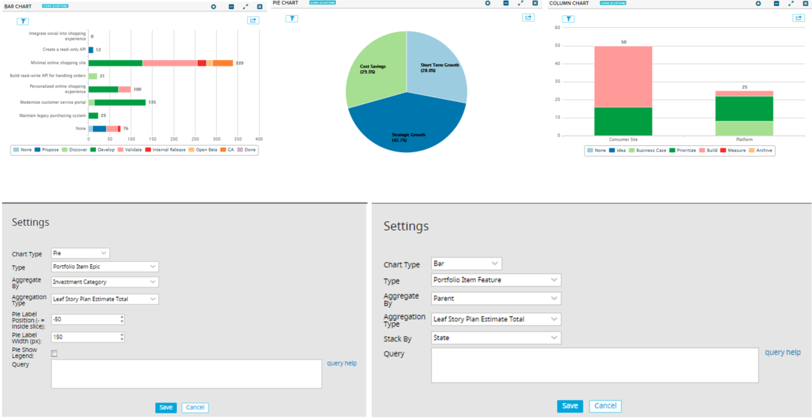

# Custom Chart

This app is the chart equivalent of the Custom Board and Custom List apps.  Pick a chart type (pie, bar or column), an object type, and a field to be aggregated and gain insight into your process via the generated chart.  Use the advanced filtering control to further slice and dice your data.  The data is also exportable for more fine grained inspection.

## Installation and Settings
The app is installed as a Custom HTML App ([see help documentation](https://help.rallydev.com/custom-html))
Once the app is installed, use the gear menu on the app panel and select "Edit App Settings". There are a few settings you can configure for each chart type.

#### Chart Type
Pick the type of chart you'd like to create.  Bar, column, and pie charts are currently supported.

#### Type
Pick the type of data to include in the chart- Defect for example.

#### Aggregate By
Pick the attribute on the previously selected type which will be used for generating the summary data for the chart.

#### Bucket By
Available for bar and column charts.  If the previously selected Aggregate By attribute is of type date this setting allows you to choose the granularity of the chart axis.  Supported values include Day, Week, Month, Quarter and Year.

#### Aggregation Type
Pick how the summary should be performed- via a simple count or by summing the plan estimates.  For charts based on Portfolio Items there are additional options based on all the rollup fields- AcceptedLeafStoryCount, LeafStoryPlanEstimateTotal, etc.

#### Stack By
Available for bar and column charts.  Pick the attribute on the previously selected type which will be used to further break down the data within each bar or column.

#### Pie ONLY Settings

Pie Label Position - Default is 30 which places the lavel outside the pie with a connecting line to the slice. -30 will place the label inside the slice.

Pie Label Width - width in pixels before the label wraps.

Pie Show Legend - Flag to display a legend box at the bottom with color / labels. This disables the label display in the slice leaving only the percent of the slice.

#### Query
In addition to the advanced filtering component in the app, you can write your own complex filter queries. [Extensive documentation](https://help.rallydev.com/grid-queries?basehost=https://rally1.rallydev.com) is available. This might be useful if you want to always limit the chart to certain complex criteria. **Note**: The special `{user}` token is supported here as well.
